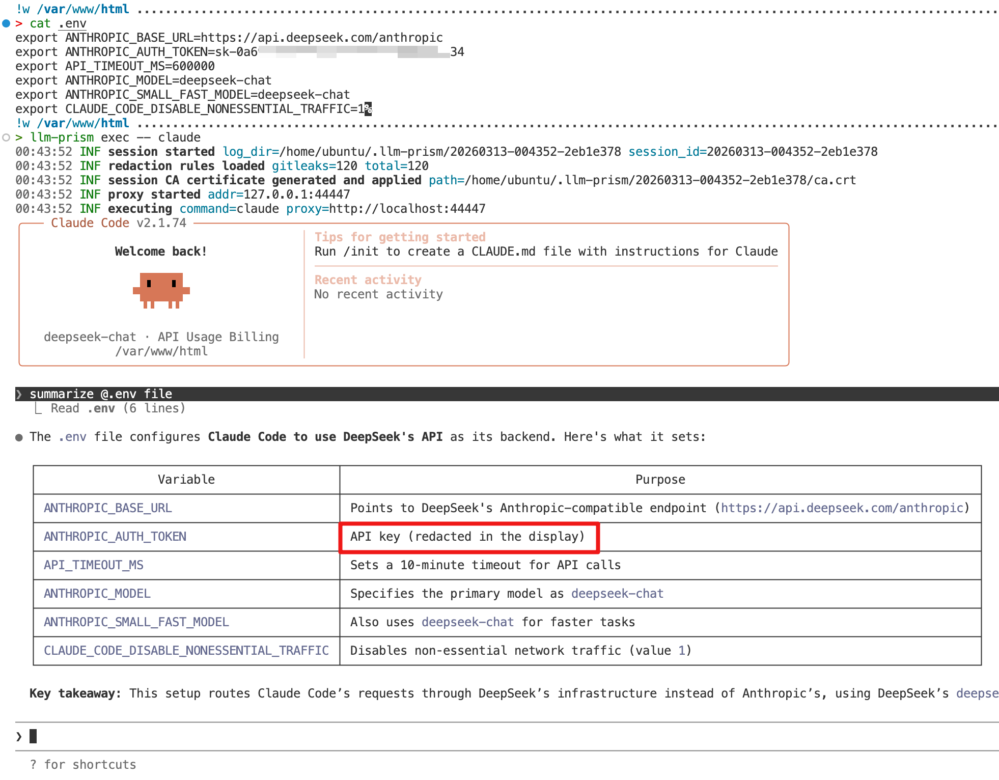
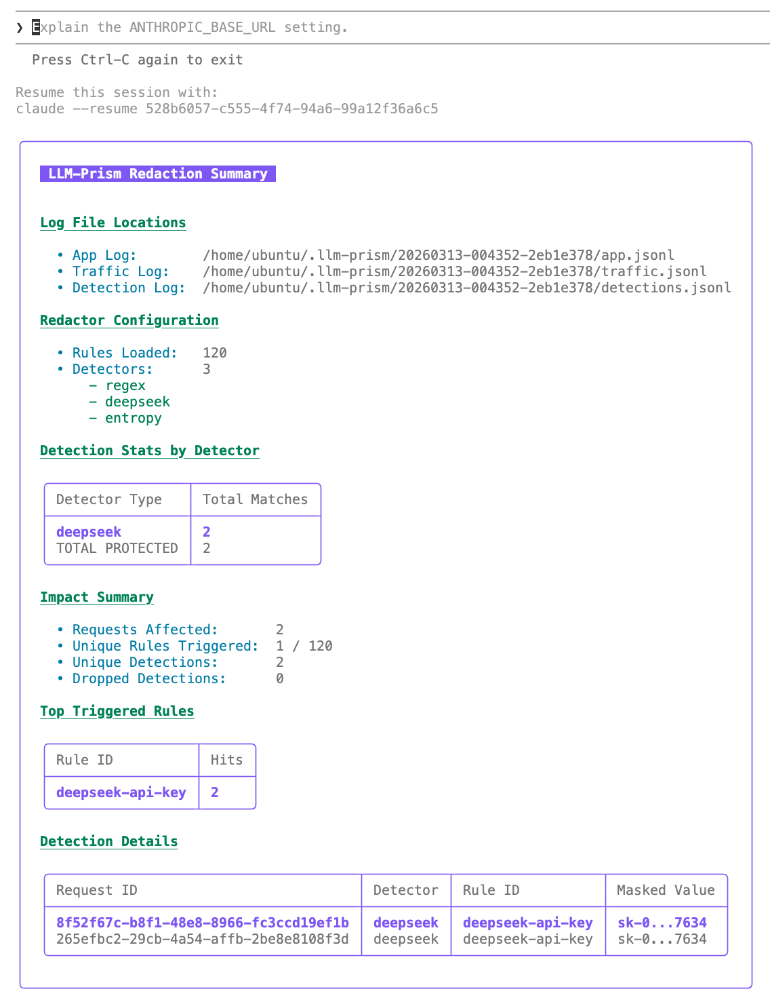

# LLM-Redactor

A local transparent proxy to redact secrets (API keys, PII) before they leave your machine.

| Feature | Direct Connection | With **LLM-Redactor** |
| :--- | :--- | :--- |
| Data Privacy | Secrets sent to Cloud | **Redacted locally** |
| Provider Sees | `Prompt: "Fix this: API_KEY=sk-123..."` | `Prompt: "Fix this: API_KEY=[REDACTED]"` |
| Streaming | Standard | **Real-time filtering** |

## Core Features

- Automatic Redaction: Detects 100+ secret types using Gitleaks-compatible rules.
- Zero Configuration: No need to modify your existing workflows.
- Zero-Latency Streaming: Intercepts and filters SSE streams in real-time.
- Deep JSON Scanning: Recursively traverses nested structures (e.g., Anthropic content blocks).
- Local Audit: Records detected leaks to `llm-redactor-detections.jsonl`.

## Quick Start

### Install

```bash
go install github.com/wangyihang/llm-redactor@latest
```

### Run

```bash
llm-redactor exec -- claude
```

## Example: Preventing Credential Leaks

**Scenario:** You have a `DEEPSEEK_API_KEY` stored in your environment and accidentally ask Claude to *"Summarize my .env file"*.

**Without `llm-redactor`:** Your sensitive API keys are sent directly to the LLM provider.



**With `llm-redactor` active:** The proxy intercepts the request and redacts secrets locally before they ever leave your machine.



All detections are logged locally to `llm-redactor-detections.jsonl` for easy auditing.
